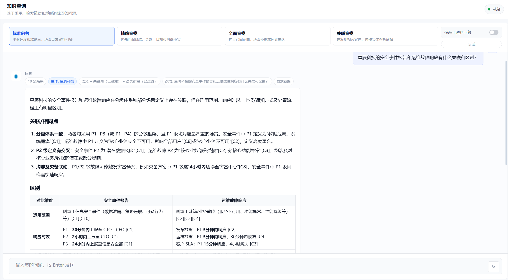
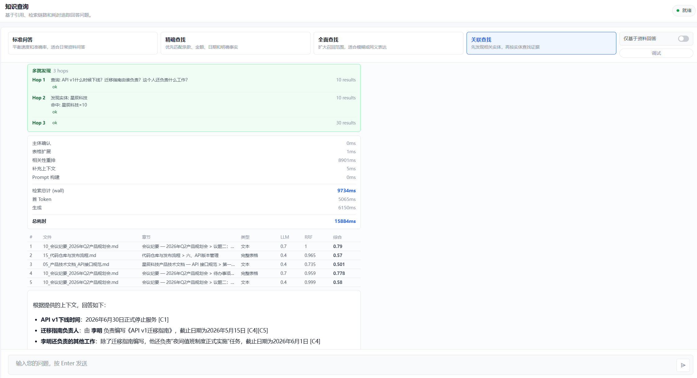
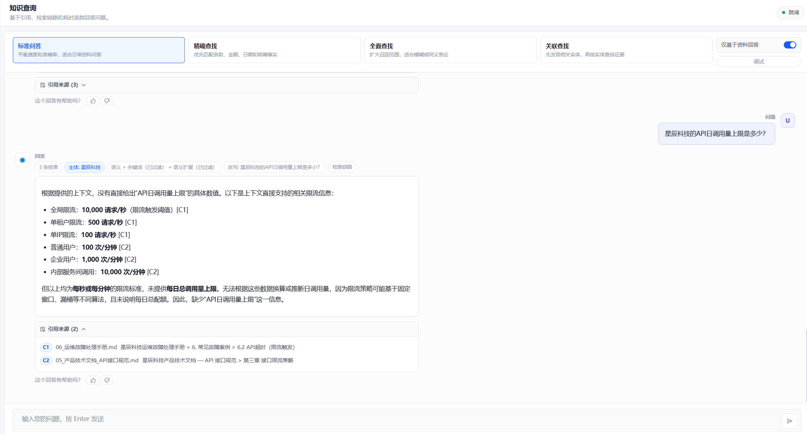
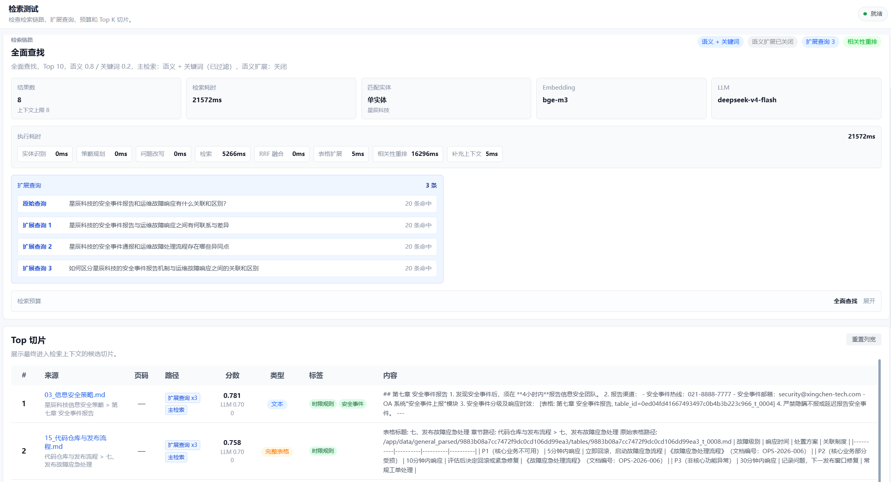
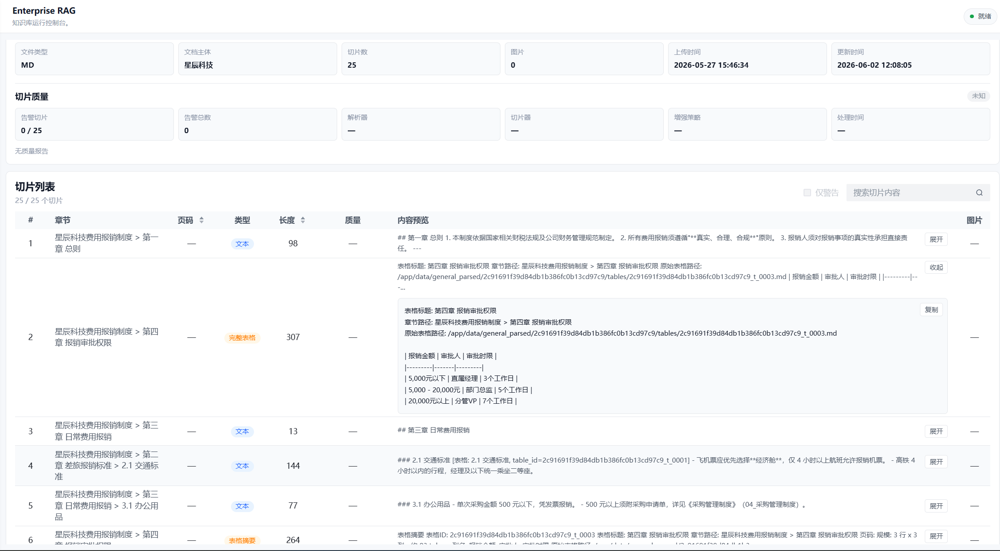
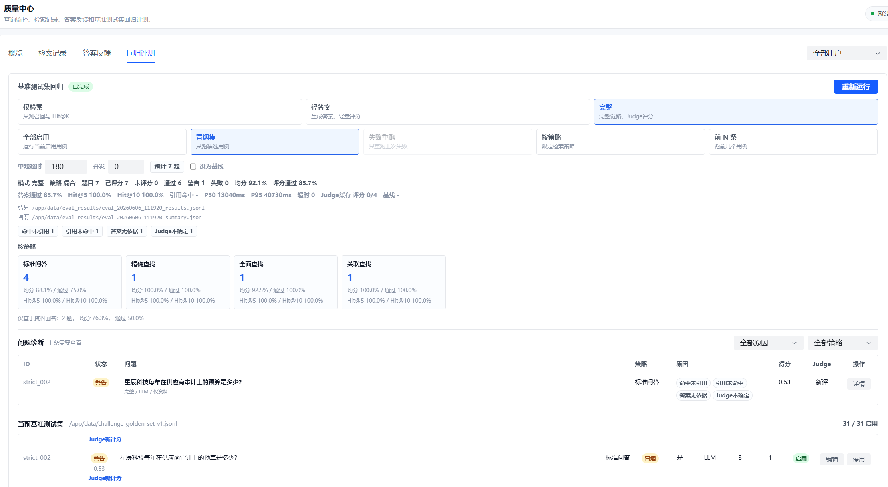
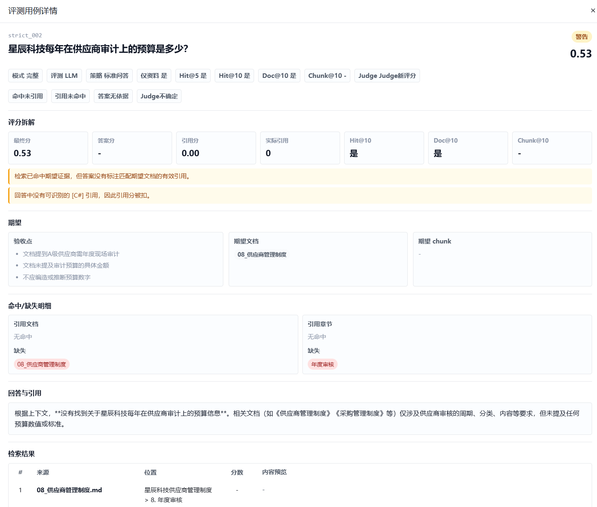

# Enterprise RAG Platform

Production-shaped enterprise document intelligence: ingest complex documents, build an inspectable knowledge base, retrieve with strategy-aware pipelines, answer with citations, and validate quality through evaluation and observability.

This repository represents a polished local-first Enterprise RAG baseline. It is not a prompt-only demo: parsing artifacts are persisted, chunks are inspectable, retrieval behavior is testable, answers are citation-validated, and regression quality is measured through a golden-set loop.

## Highlights

- **Document intelligence pipeline**: PDF via MinerU, Markdown, Markdown ZIP, image-to-text descriptions, table-aware chunking, deterministic metadata enrichment, local dense embeddings, and Milvus indexing.
- **Inspectable retrieval**: balanced, exact, recall, and discovery strategies with resolved budgets, entity routing, fallback policy, query expansion, HyDE, RRF, rerank, and context expansion.
- **Citation-grounded answers**: streaming chat with numbered evidence, source validation, strict-evidence mode, groundedness checks, and refusal behavior for unsupported facts.
- **Retrieval test bench**: run retrieval without answer generation, inspect Top K chunks, scores, retrieval paths, entity distribution, expansion queries, rerank candidates, and strategy summary.
- **Evaluation loop**: retrieval-only, answer-lite, and full modes over a curated enterprise golden set, with rule scoring, LLM judge, no-answer cases, smoke subset, baseline deltas, and failure categories.
- **Operational visibility**: query records, per-stage latency, token usage, fallback details, error classification, durable background jobs, storage health checks, and chunk quality reports.
- **Admin controls**: runtime settings, entity aliases, optional structured tag visibility, retrieval tuning, golden-set editing, feedback-to-case drafting, and job tracking.

## Architecture

```text
                          Vue 3 Frontend
        Query Chat · Documents · Retrieval Test · Quality Center
                                     │
                              HTTP / SSE
                                     ▼
                              FastAPI Backend
                                     │
     ┌───────────────────────────────┼───────────────────────────────┐
     ▼                               ▼                               ▼
Ingestion Workflow              Query Pipeline                  Admin / Ops
  LangGraph nodes                 Strategy planner                Settings
  parsing/chunking                hybrid retrieval                Eval runs
  quality reports                 rerank/citations                Jobs/health
     │                               │                               │
     └───────────────┬───────────────┴───────────────┬───────────────┘
                     ▼                               ▼
                SQLite state                    Milvus vectors
                     │                               │
                     └───────────────┬───────────────┘
                                     ▼
                    Local embeddings + external LLM APIs
```

More detail: [docs/guides/architecture.md](docs/guides/architecture.md).

## What The System Can Do

### 1. Build A Knowledge Base

The ingestion flow turns enterprise documents into traceable retrieval units:

```text
upload
  -> validate
  -> parse PDF / Markdown / ZIP
  -> describe images as text
  -> normalize markdown
  -> chunk text and tables
  -> enrich keywords, structured tags, search_text
  -> embed with local dense model
  -> upsert to Milvus
  -> write chunk quality report
```

The document detail view exposes parsed artifacts, chunk metadata, warning tags, table chunks, image references, and quality summaries so bad retrieval can be traced back to parsing or chunking problems.

### 2. Retrieve With Explicit Strategies

Users choose intent-level strategies instead of raw switches:

| UI Strategy | Internal Flavor | Intended Use | Behavior |
|---|---|---|---|
| 标准问答 | `balanced` | normal Q&A and synthesis | hybrid retrieval, optional HyDE, RRF, rerank, context expansion |
| 精确查找 | `exact` | clauses, numbers, policy source lookup | smaller budget, no HyDE/query expansion, no entity fallback |
| 全面查找 | `recall` | vague or synonym-heavy questions | query expansion, parallel searches, RRF, rerank |
| 关联查找 | `discovery` | related people/entities must be discovered first | bounded multi-hop retrieval with traceable hops |

This is a product-facing control, not just an internal parameter. The same knowledge base can be queried as a precise policy lookup, a broad recall task, a normal synthesis question, or a bounded discovery flow.

`strict_evidence` is independent from retrieval flavor. It makes the answer conservative and blocks risky inference or broad fallback when the source material does not support the target fact.

### 3. Answer With Citations

Chat responses stream over SSE and return:

- final answer text
- numbered citations
- source document and chunk metadata
- image evidence when image descriptions were used
- groundedness signal
- query trace and latency profile

The system can answer normal policy questions, synthesize across documents, compare entities, discover related people, and refuse unsupported facts under strict evidence.

### 4. Test Retrieval Without Spending LLM Tokens

The retrieval test page is a knowledge-base debugging tool. It lets you ask:

- Which chunks were retrieved?
- Which path found them: dense, sparse, HyDE, query expansion, table expansion, fallback, rerank?
- Did the right document appear before generation?
- Did entity filtering help or hurt?
- What budget and policy did the planner resolve?

This is the fastest way to debug recall before tuning prompts.

### 5. Evaluate Regressions

The baseline test set lives in:

```text
data/challenge_golden_set_v1.jsonl
```

It covers balanced Q&A, exact numeric lookup, recall/vague questions, discovery multi-hop, and strict-evidence refusal. The UI can run retrieval-only, answer-lite, or full judge-based evaluation, then compare metrics against an accepted baseline.

Latest tested demo status during project closeout: the full enterprise set completed with one known warning case. Treat this as a regression loop, not a public benchmark.

More detail: [docs/guides/evaluation.md](docs/guides/evaluation.md).

## Demo Evidence

The default demo corpus is a curated enterprise Markdown knowledge base under `data/enterprise_docs`. It covers HR, reimbursement, procurement, information security, API specs, incident runbooks, SLA, project management, meeting notes, and two demo entities: `星辰科技` and `远景能源`.

### Citation-Grounded Chat

Cross-document synthesis returns a structured answer with numbered evidence and visible retrieval trace.



### Multi-Hop Discovery

Discovery mode first finds related entities, then uses those entities to continue retrieval. This makes multi-hop behavior visible instead of hiding it inside one opaque vector search.



### Strict Evidence Mode

Strict evidence mode keeps the answer conservative when the retrieved context does not support the exact requested fact. It can still summarize nearby supported evidence without inventing the missing value.



### Retrieval Debugging

The retrieval test bench exposes query expansion, retrieval budget, model selection, latency by stage, Top K chunks, scores, tags, and retrieval paths before answer generation happens.



### Document And Chunk Inspection

Document detail pages expose chunk types, table chunks, content previews, quality status, and parsed artifact paths. This keeps ingestion and retrieval problems debuggable.



### Evaluation Loop

The Quality Center turns the golden set into a practical regression loop: run mode selection, smoke subset, Hit@K, answer pass rate, failure categories, per-strategy breakdown, and baseline comparison.



### Evaluation Diagnostics

The Quality Center can drill from aggregate run metrics into one case and show expected evidence, retrieved evidence, missing citations, answer text, and failure categories.



Useful demo queries:

| Scenario | Query | Suggested Strategy |
|---|---|---|
| Clause / amount lookup | `星辰科技的住宿标准是多少？` | 精确查找 |
| Vague recall | `电脑丢了应该怎么处理？` | 全面查找 |
| Cross-document synthesis | `星辰科技的安全事件报告和运维故障响应有什么关联和区别？` | 标准问答 |
| Multi-hop discovery | `API v1什么时候下线？迁移指南由谁负责？这个人还负责什么工作？` | 关联查找 |
| Strict evidence / missing fact | `星辰科技的API日调用量上限是多少？` with “仅基于资料回答” enabled | 标准问答 |

Full screenshot gallery and recording checklist: [docs/guides/DEMO_GUIDE.md](docs/guides/DEMO_GUIDE.md).

## Tech Stack

| Layer | Stack |
|---|---|
| Frontend | Vue 3, TypeScript, Vite, Arco Design Vue |
| API | FastAPI, SSE |
| Workflows | LangGraph-style ingestion and retrieval nodes |
| State | SQLite with WAL, startup storage guards, query/job/eval records |
| Vector Store | Milvus dense vectors + sparse/BM25 fields |
| Embeddings | Local dense embedding model, tested with BAAI/bge-m3 |
| LLM | DeepSeek-compatible chat API |
| PDF Parsing | MinerU Online API |
| Image-to-Text | Zhipu GLM-4.6V-compatible API |
| Evaluation | Golden-set runner, rule scoring, LLM judge, accepted baselines |
| Packaging | Docker Compose |

## Quick Start

The fastest path is Docker Compose:

```bash
cp .env.example .env
# edit .env: EMBEDDING_MODEL_HOST_PATH, API_TOKEN, LLM keys
docker compose up -d --build
docker compose exec backend python scripts/seed_demo.py
```

Open:

```text
Frontend: http://localhost:5173
Backend:  http://localhost:8010/health
```

Detailed setup, local venv notes, reset commands, eval commands, and troubleshooting live in [docs/guides/DEVELOPMENT.md](docs/guides/DEVELOPMENT.md). Full environment variable reference lives in [docs/guides/CONFIGURATION.md](docs/guides/CONFIGURATION.md).

## Beyond Current Version

The current system is a strong document-centric RAG foundation. The most valuable future directions are not more prompt tricks, but product hardening:

- **Tag and ACL governance**: turn current tags and document filters into credible data governance.
- **Storage maturity**: baseline migration stamping, file-storage abstraction, object storage readiness, and deeper health metrics.
- **Reparse / reindex workflows**: controlled completed-document rebuilds with job tracking.
- **Evidence trust productization**: richer support checks showing whether generated claims are actually supported by retrieved chunks.
- **Deployment readiness**: lock files, runtime profiles, production Docker images, rate limits, auth policy, and operational runbooks.
- **Connector boundary**: keep enterprise connectors out of this repo until identity, ACL sync, and source-specific governance are first-class requirements.

Longer roadmap context: [FUTURE_PLAN.md](FUTURE_PLAN.md).

## Documentation

- [Documentation Map](docs/README.md) — categorized guide to current docs and archives.
- [Architecture](docs/guides/architecture.md) — system diagrams, ingestion, retrieval, data flow.
- [Development Guide](docs/guides/DEVELOPMENT.md) — Docker, local development, commands, verification.
- [Configuration](docs/guides/CONFIGURATION.md) — complete environment variable reference.
- [Demo Guide](docs/guides/DEMO_GUIDE.md) — demo path, screenshots, recording checklist.
- [Evaluation](docs/guides/evaluation.md) — golden set design, modes, scoring, UI workflow.
- [Smoke Test](docs/guides/smoke_test.md) — manual regression checklist.
- [Project Market Evaluation](docs/product/project_market_evaluation.md) — product/market assessment.
- [Storage Layer Maturity](docs/roadmaps/storage_layer_maturity.md) — storage hardening and deferred roadmap.
